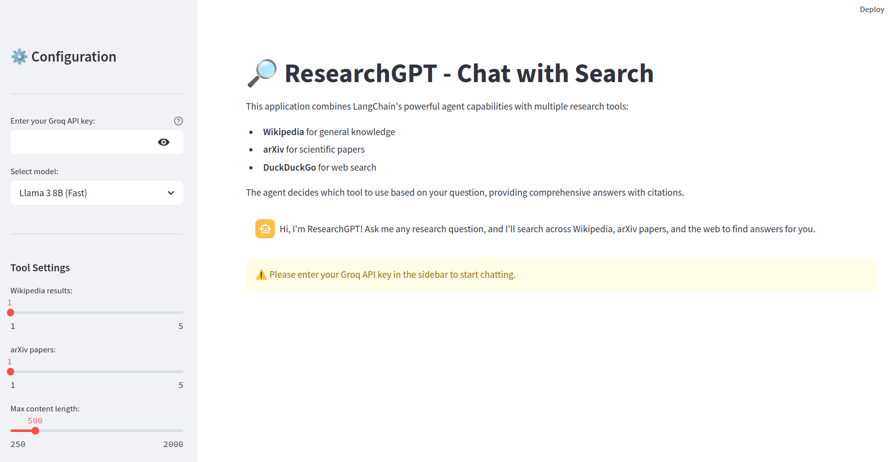

# ResearchGPT - AI-Powered Research Assistant



## 🔎 Overview

ResearchGPT is an AI-powered research assistant that helps users find information from multiple sources using natural language queries. It combines LangChain's agent capabilities with Groq LLMs to provide comprehensive answers by searching across:

- 📚 **Wikipedia** for general knowledge
- 📑 **arXiv** for scientific papers and research
- 🌐 **DuckDuckGo** for web search results

## 🚀 Getting Started

### Prerequisites

- Python 3.8+
- Groq API key (get one at [console.groq.com](https://console.groq.com/keys))

### Installation

1. Clone this repository:
   ```bash
   git clone https://github.com/yourusername/researchgpt.git
   cd researchgpt
   ```

2. Install dependencies:
   ```bash
   pip install -r requirements.txt
   ```

3. Run the application:
   ```bash
   streamlit run app.py
   ```

4. Open your browser and navigate to `http://localhost:8501`

### Environment Variables (Optional)

You can set your Groq API key as an environment variable to avoid entering it each time:

```bash
export GROQ_API_KEY=your_api_key_here
```

## 📊 Usage

1. Enter your Groq API key in the sidebar (if not set as an environment variable)
2. Select your preferred LLM model
3. Adjust tool settings if needed
4. Type your research question in the chat input
5. Explore the AI's response, which will show its reasoning process and the tools it used

### Example Questions

- "What are the latest developments in quantum computing?"
- "Explain the impact of climate change on coral reefs"
- "How do mRNA vaccines work?"
- "What research exists on sleep and memory consolidation?"
- "Summarize recent papers on transformer neural networks"

## 🛠️ Technical Details

This application uses:

- **Streamlit**: For the web interface and UI components
- **LangChain**: For agent orchestration and tool integration
- **Groq**: For fast LLM inference
- **Wikipedia API**: For encyclopedia knowledge
- **arXiv API**: For scientific papers
- **DuckDuckGo Search**: For web results

The agent uses a zero-shot reasoning approach to determine which tool to use based on the query content.